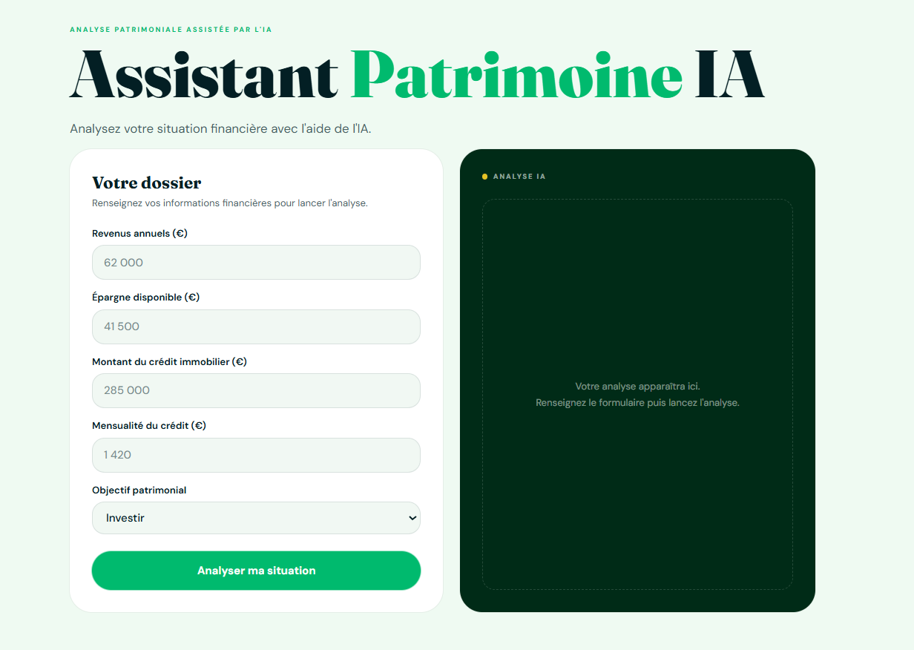
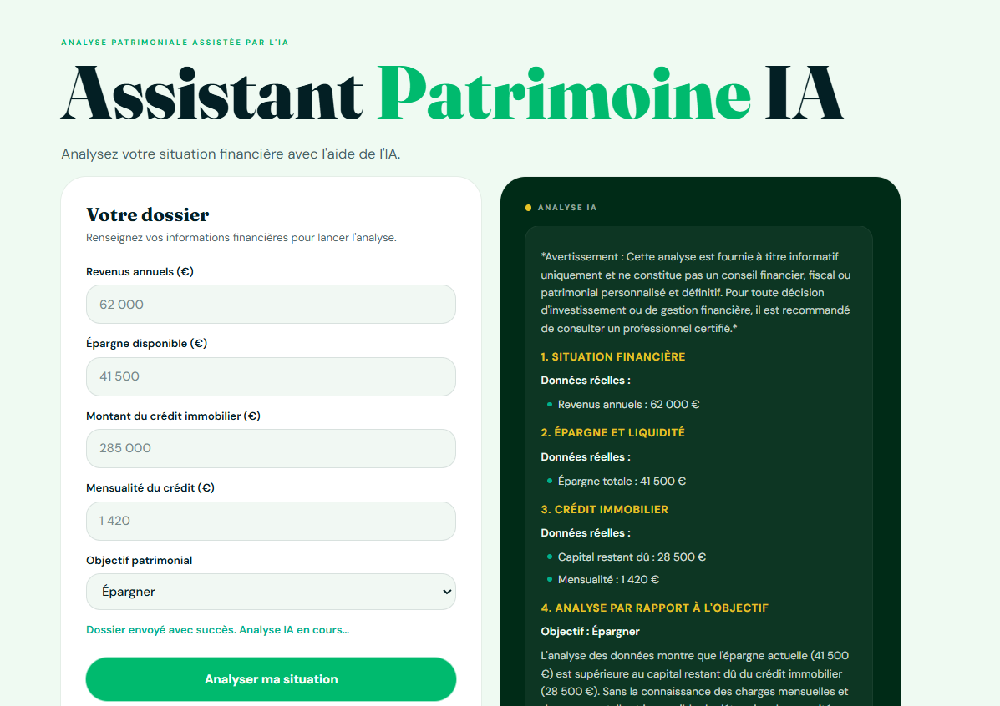
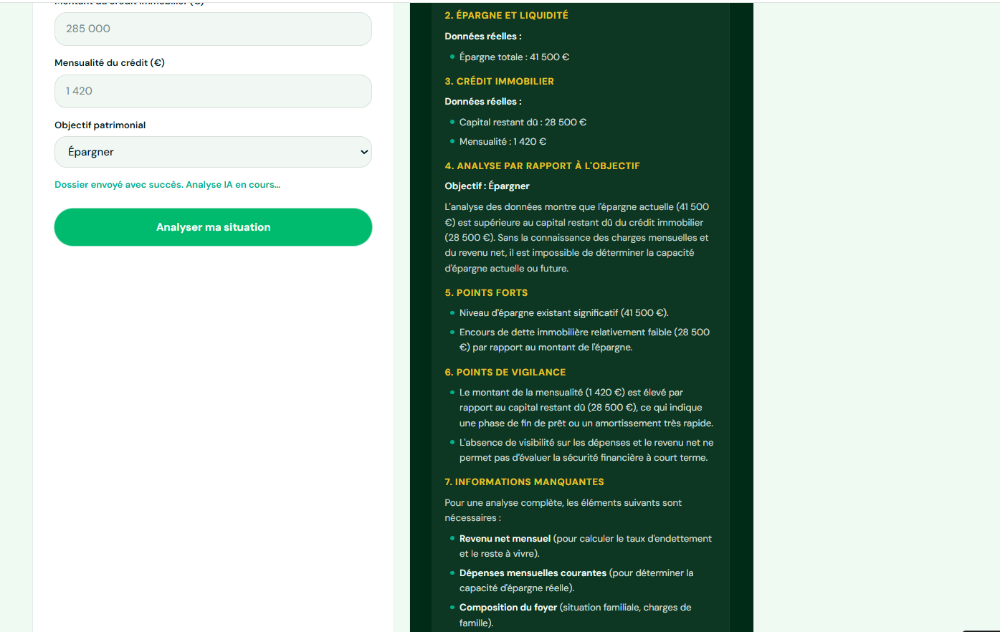
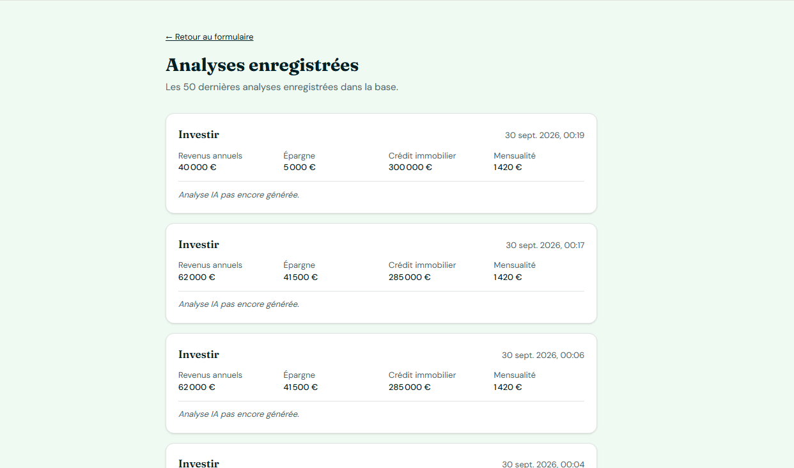

# Assistant Patrimoine IA

[](https://lovable.dev/)
[](https://n8n.io/)
[](https://supabase.com/)
[](https://ai.google.dev/)


Application web permettant à un utilisateur de renseigner sa situation financière et son objectif patrimonial afin d'obtenir une **analyse générée par intelligence artificielle**.

> **Projet de démonstration** - L'analyse générée par l'IA est fournie à titre informatif et ne constitue pas un conseil financier personnalisé.

---

## Fonctionnalités

* Saisie des informations financières
* Définition d'un objectif patrimonial
* Génération d'une analyse avec **Gemini**
* Stockage des données dans **Supabase**
* Stockage de l'analyse IA
* Affichage de l'analyse directement dans l'interface
* Gestion du traitement asynchrone
* Gestion des erreurs

---

## Technologies

| Technologie  | Utilisation                                     |
| ------------ | ----------------------------------------------- |
| **Lovable**  | Frontend et interface utilisateur               |
| **n8n**      | Orchestration du workflow et traitement backend |
| **Supabase** | Base de données PostgreSQL                      |
| **Gemini**   | Génération de l'analyse IA                      |

---

## Architecture

```text
                    ┌─────────────────┐
                    │    Utilisateur  │
                    └────────┬────────┘
                             │
                             ▼
                    ┌─────────────────┐
                    │     Lovable     │
                    │    Frontend     │
                    └────────┬────────┘
                             │
                        POST Webhook
                             │
                             ▼
                    ┌─────────────────┐
                    │       n8n       │
                    │  Orchestration  │
                    └────┬───────┬────┘
                         │       │
                         │       ▼
                         │  ┌─────────────┐
                         │  │   Gemini    │
                         │  │   LLM / IA  │
                         │  └──────┬──────┘
                         │         │
                         ▼         ▼
                    ┌─────────────────┐
                    │    Supabase     │
                    │   PostgreSQL    │
                    └────────┬────────┘
                             │
                             ▼
                    ┌─────────────────┐
                    │     Lovable     │
                    │ Affichage de    │
                    │ l'analyse IA    │
                    └─────────────────┘
```

---

## Fonctionnement

### 1. Saisie

L'utilisateur renseigne :

* Revenus annuels
* Épargne disponible
* Crédit immobilier
* Mensualité
* Objectif patrimonial

Exemple :

```json
{
  "revenus_annuels": 58000,
  "epargne": 24000,
  "credit_immobilier": 180000,
  "mensualite": 950,
  "objectif": "Acheter une résidence secondaire dans 5 ans"
}
```

### 2. Envoi vers n8n

Lovable envoie les données au **Webhook n8n**.

### 3. Enregistrement dans Supabase

n8n crée un enregistrement dans Supabase afin de conserver les informations saisies.

### 4. Analyse avec Gemini

n8n transmet les données à Gemini afin de générer une analyse financière structurée.

### 5. Mise à jour de Supabase

Une fois l'analyse générée, n8n met à jour l'enregistrement avec le résultat dans le champ :

```text
analyse_ia
```

### 6. Affichage

Lovable récupère l'analyse et l'affiche à l'utilisateur.

---

## Analyse IA

Le prompt envoyé à Gemini contient notamment des règles visant à limiter les réponses non fondées.

L'IA doit notamment :

* utiliser uniquement les informations disponibles ;
* ne pas inventer de données ;
* identifier les informations manquantes ;
* distinguer les données fournies des hypothèses ;
* éviter de calculer un indicateur lorsque les données nécessaires sont absentes.

L'analyse peut contenir :

* **Résumé de la situation**
* **Situation financière**
* **Épargne**
* **Crédit immobilier**
* **Analyse de l'objectif**
* **Points forts**
* **Points d'attention**
* **Informations manquantes**
* **Pistes générales à explorer**

---

## Problèmes rencontrés

### 1. Erreur 404 du Webhook

Au début, l'application retournait une erreur :

```text
Échec de l'envoi au serveur d'analyse (code 404)
```

Le problème venait de l'URL utilisée par Lovable : l'application utilisait l'URL de test du Webhook n8n au lieu de l'URL de production.

**Solution :**

Remplacement de l'URL de test par la **Production URL** du Webhook n8n.

---

### 2. Analyse IA non disponible immédiatement

n8n devait :

1. recevoir les données ;
2. appeler Gemini ;
3. attendre la génération de l'analyse ;
4. enregistrer le résultat dans Supabase.

L'analyse pouvait donc ne pas être disponible immédiatement lorsque Lovable effectuait sa première récupération.

**Solution :**

Le workflow retourne un identifiant permettant à Lovable de retrouver l'enregistrement correspondant et de vérifier la disponibilité de `analyse_ia` avant de l'afficher.

Cela permet de gérer le traitement de manière **asynchrone**.

---

## Aperçu de l'application

### Formulaire



### Analyse IA






### Historiques des analyses



---

## Améliorations prévues

Plusieurs évolutions sont prévues :

* Authentification des utilisateurs
* Analyse Gemini retournée au format **JSON structuré**
* Amélioration de l'interface utilisateur
* Gestion avancée des erreurs
* Statuts de traitement : `processing`, `completed`, `error`
* Sécurisation des données avec les **RLS de Supabase**


---

## Compétences mises en œuvre

### Frontend

* Lovable
* Formulaires
* Appels HTTP
* Webhooks
* Affichage dynamique

### Backend / Automation

* n8n
* Workflows
* Webhooks
* Communication entre services
* Gestion du traitement asynchrone

### Base de données

* Supabase
* PostgreSQL
* Création et mise à jour de données

### Intelligence artificielle

* Gemini
* Prompt engineering
* Génération de texte
* Gestion des données manquantes
* Limitation des hallucinations

### Architecture

* Communication **Frontend → Backend → Base de données → LLM**
* Intégration de services externes
* Gestion d'un workflow IA asynchrone

---

## Structure du projet

```text
assistant-patrimoine-ia/
│
├── src/
│   ├── components/
│   ├── pages/
│   └── ...
│
├── screenshots/
│   ├── formulaire.png
│   ├── analyse.png
│   └── dashboard.png
│
├── public/
│
├── package.json
└── README.md
```

---

## Installation

### Prérequis

* Node.js
* npm

### Installation

```bash
git clone <url-du-repository>

cd assistant-patrimoine-ia

npm install
```

### Lancement

```bash
npm run dev
```

L'application peut ensuite être ouverte depuis l'adresse indiquée par Vite.

---

## Architecture du projet

```text
Lovable
   │
   │ HTTP / Webhook
   ▼
n8n
   │
   ├──► Supabase
   │      └── Stockage des données
   │
   └──► Gemini
          └── Génération de l'analyse
                 │
                 ▼
              Supabase
                 │
                 ▼
              Lovable
                 │
                 ▼
          Affichage utilisateur
```

---

## Objectif du projet

Ce projet a été réalisé afin de mettre en pratique l'intégration d'une **intelligence artificielle générative dans une application web**, en combinant :

**Frontend + automatisation + base de données + LLM**

Il permet également de travailler sur des problématiques concrètes telles que les Webhooks, les erreurs HTTP, le traitement asynchrone, le stockage des résultats et l'intégration d'une API d'intelligence artificielle.
